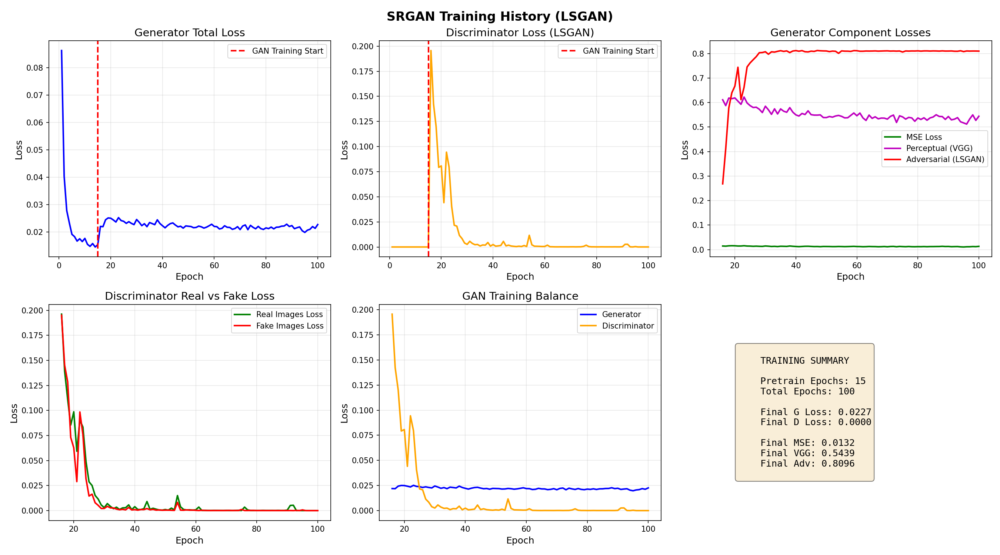
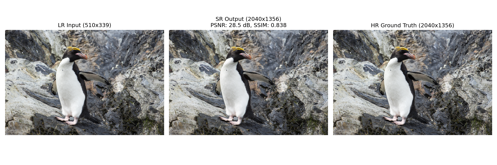

# SRGAN Super Resolution Web Application

**4x Single Image Super Resolution using Generative Adversarial Networks**

    

---

## Overview

SRGAN (Super-Resolution Generative Adversarial Network) is a deep learning model that enhances low-resolution images by 4x while preserving and generating realistic textures. This project implements a complete web application with FastAPI backend and modern web interface.

### Key Features
- 4x Super Resolution (e.g., 100x100 to 400x400)
- GPU-accelerated inference using CUDA
- Drag-and-drop web interface
- Image enhancement controls (color and sharpness)
- Comparison mode (SRGAN vs Bicubic)
- Batch processing (up to 10 images)
- Automatic image saving and upload logging
- Admin monitoring endpoints

---

## Project Structure

```text
SRGAN Project/
├── main.py                     # FastAPI application
├── model.py                    # SRGAN Generator architecture
├── requirements.txt            # Dependencies
├── README.md                   # Documentation
├── LICENSE                      # GPL v3 License
├── SRGAN Generator Model.pth   # Trained model weights
├── templates/
│   └── index.html              # Web interface
├── static/
│   ├── css/
│   │   └── style.css           # Styling
│   └── js/
│       └── main.js             # Frontend logic
├── uploads/                    # Auto-created directories
│   ├── original/               # Uploaded original images
│   ├── results/                # Processed SRGAN results
│   └── logs/
│       └── upload_history.json # Upload history
└── training_results/
    ├── comparison_results.png  # SRGAN vs Bicubic
    ├── test_inference.png      # Single image test
    └── training_history.png    # Training metrics
```
---

## Model Architecture

### Generator Architecture (SRGAN)
#### Text Representation
```text
Input (LR) ➔ Conv9x9 ➔ PReLU ➔ [16x Residual Blocks] ➔ Conv3x3 ➔ BatchNorm ➔ Skip Connection (+) ➔ PixelShuffle (2x) ➔ PixelShuffle (2x) ➔ Conv9x9 ➔ Tanh ➔ Output (HR)
```
**Key Components:**
- 16 Residual Blocks with skip connections
- 2 PixelShuffle layers for 4x upscaling
- PReLU activation for adaptive learning
- Approximately 1.5M parameters

### Discriminator (Training Only)
- 8 convolutional layers
- LeakyReLU (alpha=0.2) activations
- Batch Normalization
- 512-dimensional feature space

---

## Training Process

### Dataset
- **DIV2K Dataset**: 800 training + 100 validation images (2K resolution)
- **Training Patches**: Random 96x96 crops from HR images
- **LR Generation**: 4x downscaling using Bicubic interpolation

### Training Configuration

| Parameter | Value |
|-----------|-------|
| Total Epochs | 100 |
| Pretrain Epochs | 15 (MSE only) |
| GAN Epochs | 85 (Full LSGAN) |
| Batch Size | 8 |
| Generator LR | 0.0001 |
| Discriminator LR | 0.0001 |
| Optimizer | Adam (beta1=0.9, beta2=0.999) |
| LR Scheduler | ReduceLROnPlateau |

### Loss Function Weights (GAN Phase)

| Loss | Weight | Purpose |
|------|--------|---------|
| MSE | 1.0 | Pixel accuracy |
| Perceptual (VGG19) | 0.01 | Feature similarity |
| Adversarial (LSGAN) | 0.005 | Realistic textures |

### Two-Phase Training

**Phase 1: Pretraining (Epochs 1-15)**
- Generator trained with MSE Loss only
- Learn basic upscaling
- Avoid early GAN instability

**Phase 2: GAN Training (Epochs 16-100)**
- LSGAN (Least Squares GAN) for stability
- Label smoothing: Real=0.9, Fake=0.1
- Gradient clipping: G=0.01, D=0.01
- Combined loss: MSE + VGG19 + Adversarial

### Data Augmentation
- Random 96x96 crops (100%)
- Random horizontal flips (50%)
- Random 90 degree rotations (50%)

---

## Training Results

### Performance Metrics

| Metric | Value | vs Bicubic |
|--------|-------|------------|
| PSNR | 28-32 dB | +3-5 dB |
| SSIM | 0.85-0.92 | Significant gain |

### Visual Results

**Training History:**

Shows Generator/Discriminator loss convergence and component losses over 100 epochs.

**Model Comparison:**

Left: Low-resolution input | Center: SRGAN output | Right: Ground truth HR

**Single Image Test:**

Demonstrates 4x super-resolution on a validation image.

---

## Installation

### Prerequisites
- Python 3.10
- CUDA-capable GPU (optional, for faster processing)
- 4GB+ RAM, 4GB+ VRAM (GPU)

### Step 1: Navigate to Project
```bash
cd "PATH\SRGAN Project"
```
### Step 2: Create Virtual Environment
```bash
conda create -n srgan python=3.10
conda activate srgan
```

### Step 3: Install Dependencies
```bash
pip install -r requirements.txt
```

### Step 4: Install PyTorch with CUDA

```bash
pip install torch==2.5.1+cu121 torchvision==0.20.1+cu121 torchaudio==2.5.1+cu121 --index-url https://download.pytorch.org/whl/cu121
```

### Step 5: Verify Installation

```bash
python -c "import torch; print(f'PyTorch: {torch.__version__}'); print(f'CUDA: {torch.cuda.is_available()}')"
```

## Usage

### Start the Server
```bash
cd "PATH\SRGAN Project"
conda activate srgan
uvicorn main:app --host 0.0.0.0 --port 8000 --reload
```

### Access Web Interface
Open your browser and go to: [http://localhost:8000](http://localhost:8000)

---

## Features & Workflows

### Single Image Processing
1. Click the upload area or drag and drop an image.
2. A preview will appear immediately.
3. Adjust enhancement sliders (optional):
   - **Color Enhancement:** 0.5x - 2.0x
   - **Sharpness Enhancement:** 0.5x - 2.0x
4. Click **"Process Image"**.
5. View the original and super-resolved results side by side.
6. Download the final result.

### Comparison Mode
1. Switch to the **"Compare"** tab.
2. Upload an image.
3. Click **"Compare Methods"**.
4. View a comprehensive side-by-side comparison: **Original vs Bicubic vs SRGAN**.

### Batch Processing
1. Switch to the **"Batch Process"** tab.
2. Select multiple images (maximum of 10).
3. Preview all selected images in the grid layout.
4. Click **"Process All Images"**.
5. View and manage all processed results in the gallery.

---

## API Endpoints

| Endpoint | Method | Description |
| :--- | :---: | :--- |
| `/` | `GET` | Web interface / Dashboard |
| `/super-resolve` | `POST` | Process single image with adjustments |
| `/compare` | `POST` | Compare SRGAN vs Bicubic vs Original |
| `/model-status` | `GET` | Retrieve system and active model info |
| `/health` | `GET` | Health check endpoint for monitoring |
| `/view-logs` | `GET` | View system upload history |
| `/view-images` | `GET` | View saved original and processed images |

### API Usage Example (Python)
```python
import requests

url = "http://localhost:8000/super-resolve"
files = {'file': open('image.jpg', 'rb')}
data = {'color_enhance': 1.2, 'sharpness_enhance': 1.1}

response = requests.post(url, files=files, data=data)
result = response.json()
print(result)
```

---

## Admin Monitoring & Data Management

### View Upload History
* **URL:** [http://localhost:8000/view-logs](http://localhost:8000/view-logs)
* **Returns:** JSON object containing comprehensive upload details: timestamps, client IP addresses, filenames, and total processing times.

### View Saved Images
* **URL:** [http://localhost:8000/view-images?page=1&per_page=20](http://localhost:8000/view-images?page=1&per_page=20)
* **Returns:** Paginated list containing all stored original and super-resolved result images.

### Local Storage Structure
```text
uploads/
├── original/       # All uploaded source images
├── results/        # All generated super-resolved results
└── logs/
    └── upload_history.json  # Complete historical usage log file
```

---

## Performance & System Requirements

### Processing Speed (NVIDIA GPU Acceleration)
| Input Size | Output Size | Average Time |
| :---: | :---: | :---: |
| 100x100 | 400x400 | ~0.3s |
| 200x200 | 800x800 | ~0.5s |
| 500x500 | 2000x2000 | ~1.5s |

### System Requirements
| Component | Minimum Requirements | Recommended Specifications |
| :--- | :--- | :--- |
| **CPU** | 2 cores | 4+ cores |
| **RAM** | 4 GB | 8+ GB |
| **GPU** | Optional (CPU Fallback) | NVIDIA GTX 1060+ or better |
| **VRAM** | N/A | 4+ GB |
| **Storage** | 500 MB free space | 2+ GB free space |
| **OS** | Windows 10/11, Linux, macOS | Windows 11, Ubuntu 20.04+ |

---

## Troubleshooting

* **Model file not found:** Ensure the trained model checkpoint (`.pth`) file is correctly placed in the root directory of the project.
* **CUDA out of memory:** Reduce the input image dimensions or disable GPU acceleration to process using CPU mode instead.
* **Port already in use:** Modify the port address during deployment:
  ```bash
  uvicorn main:app --host 0.0.0.0 --port 8080 --reload
  ```
* **Module not found:** Ensure all required modules are installed in your active environment:
  ```bash
  pip install -r requirements.txt
  ```

---

## Technical Specifications

* **Input Specifications:**
  * Supported Formats: `JPG`, `PNG`, `BMP`
  * Color Mode: RGB (automated color mode conversion built-in)
  * Minimum Resolution: 4x4 pixels
  * Optimal Resolution Range: 100x100 to 500x500 pixels
* **Output Specifications:**
  * Scale Factor: **4x (Fixed)**
  * Output Format: `PNG` (lossless high-quality preservation)
  * Color Depth: 24-bit RGB
  * Post-Processing: Adjustable real-time color and sharpness filters

---

## Credits & License

### Project Credits
* **Architecture:** SRGAN Paper (*Photo-Realistic Single Image Super-Resolution Using a Generative Adversarial Network*, Ledig et al., 2017)
* **Framework Stack:** PyTorch, FastAPI
* **Dataset:** DIV2K (NTIRE 2017 Benchmark Dataset)
* **Perceptual Loss Foundation:** VGG19 (ImageNet Pretrained network layers)

### License
This project is officially licensed under the **GNU General Public License v3.0**.

```text
GNU GENERAL PUBLIC LICENSE Version 3, 29 June 2007

Copyright (C) 2024

This program is free software: you can redistribute it and/or modify it under 
the terms of the GNU General Public License as published by the Free Software 
Foundation, either version 3 of the License, or (at your option) any later version.

This program is distributed in the hope that it will be useful, but WITHOUT ANY 
WARRANTY; without even the implied warranty of MERCHANTABILITY or FITNESS FOR A 
PARTICULAR PURPOSE. See the GNU General Public License for more details.
```
For more information, please visit [https://www.gnu.org/licenses/](https://www.gnu.org/licenses/).

